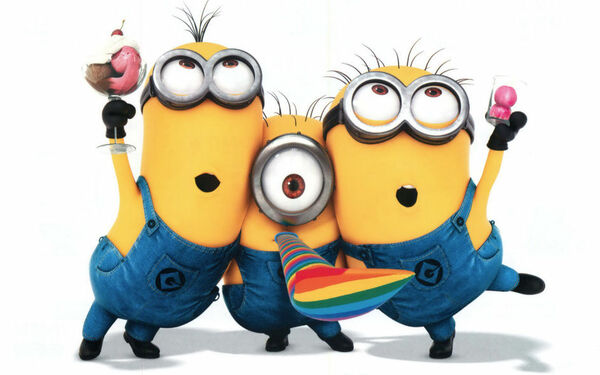

# Minions

## Antes de empezar: algunos consejos

El enunciado tiene **mucha** información, van a necesitar leerlo varias veces. La sugerencia es que lo lean entero una vez (para tener una idea general) y luego vuelvan a consultarlo las veces que hagan falta.

Concentrensé en los requerimientos y, excepto que se traben mucho, respeten el orden sugerido. No es necesario que hagan TDD, pero sí sería interesante que vayan creando las distintas clases y métodos a medida que resuelven cada requerimiento y no antes. 

En otras palabras: trabajen completando cada requerimiento antes de pasar al siguiente, con los tests que aseguran que funciona incluidos. Si al avanzar en los requerimientos les parece necesario refactorizar, adelante, van a tener los tests que garantizan que no rompieron nada. :smirk: 

## Descripción del dominio

Una importante científica local nos pide que desarrollemos un programa que modele el comportamiento habitual de sus empleados, con el fin de organizar mejor la asignación de trabajo. Estos empleados, lejos de ser trabajadores normales, son unas criaturas genéticamente diseñadas por ella para adecuarse mejor a las distintas tareas que deben realizarse en su laboratorio.

Según nos cuentan, existen dos razas de empleados: Bíclopes y Cíclopes.

**Los Bíclopes** tienen dos ojos, no tienen problemas para realizar ninguna tarea y su estamina está limitada a un máximo de 10 puntos.

**Los Cíclopes** tienen un solo ojo, lo cual hace que les cueste bastante apuntar un arma: sólo aciertan la mitad de los disparos. No tienen límite a la estamina que pueden tener.

También sabemos que, en el laboratorio, cada empleado tiene asignado un rol. Este rol se elige arbitrariamente, podría cambiar de un día para el otro y no depende de la raza del empleado (cualquier empleado podría tener cualquier rol). 

Los roles que existen son:

* **Soldado** están equipados con un arma que les facilita la defensa del laboratorio. Cada vez que un soldado usa su arma para defender un sector, gana práctica y se vuelve un poquito mejor con ella, incrementando en 2 el daño que causa. Si por algún motivo el soldado cambia de rol, toda la práctica ganada se pierde.
* **Obrero** tienen un cinturón con varias herramientas (cada uno puede tener herramientas distintas).
* **Limpiador** prefieren tener las manos limpias, así que van a negarse a defender sectores.

En cualquier momento, la científica podría ordenarle a cualquiera de sus empleados que realice una tarea en el laboratorio. Cada una de estas tareas tiene:

* una serie de **requerimientos** que el empleado debe cumplir para poder ejecutarla, 
* una **dificultad**, que es un número entero,
* algún tipo de **efecto** sobre la estamina del empleado.
  
A cualquier empleado puede ordenársele que realice **cualquier** tarea, independientemente de su raza o rol. En caso de cumplir con los requerimientos el empleado la realiza en el momento; de lo contrario debe lanzar un error ya que no puede hacer lo pedido.

Para recuperar la estamina perdida, los empleados pueden comer una fruta. Las bananas recuperan 10 puntos, las manzanas 5 y las uvas 1. Por último, diremos que un empleado está contento si su nivel de estamina es de, al menos, 30 puntos.

Enumeramos debajo las tareas posibles.

### Arreglar una máquina 

Las máquinas tienen cierta **complejidad** asociada y cada una podría requerir distintas **herramientas** para arreglarla. Para simplificar el modelo, vamos a decir que las herramientas son simplemente `Strings`, por ejemplo: `"martillo"`, `"llave allen de 3/4"` `"pala corazón"`.

Para poder arreglar una máquina hay dos requerimientos:
* tener tanta estamina como complejidad tenga la máquina, 
* tener las herramientas necesarias para arreglarla. Nótese que si la máquina no requiere de ninguna herramienta, cualquier empleado con estamina suficiente puede arreglarla.

Trabajar en una máquina es agotador, así que los empleados pierden tantos puntos de estamina como complejidad de la máquina al arreglarla. La dificultad para este tipo de tareas es el doble de la complejidad de la máquina.

### Defender un sector

El laboratorio está dividido en sectores, los cuales ocasionalmente pueden estar a la merced de alguna amenaza. De cada sector sabemos si **es grande** o no, si **está limpio** o no y cuál es el **grado de amenaza** que está sufriendo (un número entero).

Defender un sector requiere que el empleado pueda aplicar una fuerza igual o mayor al grado de amenaza, excepto para los limpiadores, que _nunca_ pueden defender un sector. La fuerza de un empleado es `la mitad de su estamina + 2`, y en el caso de los Soldados, se le suma a eso el daño extra.

Los Bíclopes pueden aplicar toda su fuerza, mientras que los Ciclopes, por eso de que sólo impactan la mitad de los ataques, pueden aplicar solamente la mitad de su fuerza para defender un sector.

Algunos ejemplos:
* un Bíclope Soldado con 20 de estamina y 4 de daño extra tendrá una fuerza de 16 (`20 / 2 + 2 + 4`);
* un Cíclope Soldado con los mismos valores tendrá una fuerza de 8;
* un Cíclope Obrero con 20 de estamina tendrá una fuerza de 12 (`20 / 2 + 2`).

Al defender un sector, los obreros pierden la mitad de su estamina y los soldados incrementan su daño extra en 2. Una vez defendido, su grado de amenaza queda en cero y deja de estar limpio, por los desmanes que ocasionó la batalla.

La dificultad de esta tarea es el grado de amenaza para los Bíclopes y el doble de ese valor para los Cíclopes.

### Limpiar un sector

Ocasionalmente el laboratorio se ensucia y depende de los empleados mantenerlo en orden. La dificultad de este tipo de tareas es de 10 puntos, pero el sistema tiene que contemplar la posibilidad de cambiar este valor para _todas_ las tareas a la vez.

Para poder limpiar un sector se requiere tener al menos 4 puntos de estamina si es grande y 1 si no lo es. Al limpiar se pierde la estamina requerida para limpiar el sector, a menos que el empleado tenga rol de limpiador. Los limpiadores siempre pueden limpiar (se saltean el chequeo de los puntos de estamina) y no pierden estamina al hacerlo.

Obviamente, luego de ser limpiado el sector debería quedar limpio (o en otras palabras: hay que actualizar la variable :sweat_smile:). 

## Requerimientos

Se pide implementar la solución a este problema en Kotlin, junto con los tests que prueben cada uno de los requerimientos.

1. Que un empleado pueda comer una fruta para recuperar estamina.
1. Conocer la experiencia de un empleado, que se obtiene a partir de la cantidad de tareas realizadas multiplicada por la sumatoria de sus dificultades.
1. Saber si un empleado puede realizar una tarea o no. Ojo, que para este requerimiento solo queremos ver _si podría_ hacerla, no pedimos que la haga. 
1. Ahora sí, hacer que un empleado realice una tarea, teniendo en cuenta las restricciones descriptas anteriormente. Si no puede hacerla, debe lanzarse un error.
  
Agregar un nuevo rol: el Capataz, que se comporta de manera similar a un Obrero pero además tiene a su cargo a otros empleados. Tener en cuenta lo siguiente:

* Cuando se le pide que haga algo, se lo delega a su subordinado con mayor nivel de experiencia de los que puedan realizar la tarea. Si no hay ninguno que pueda hacerla, debe hacerla él. Si él tampoco puede hacer la tarea, se arroja el error correspondiente.
* Su experiencia es la suma de la experiencia de sus subordinados más la propia, que adquiere cuando a él le toca ejecutar alguna tarea.
* Para saber si puede realizar una tarea, hay que mirar si alguno de sus subordinados puede hacerla o si él mismo puede hacerla.

Incorporar al modelo el Laboratorio, que conoce a todos los sectores, todos los empleados y a una lista de tareas pendientes. Debe poder responder a los siguientes requerimientos:

6. Poder determinar si está en orden: esto es así si todos sus sectores están limpios, sin amenazas y todos sus empleados están contentos.
7. Ejecutar una jornada laboral, haciendo que los empleados realicen todas las tareas pendientes. Para cada tarea, se elige a cualquiera de los empleados que pueda realizarla y una vez completada se la saca de la lista. Si quedan tareas pendientes que nadie pudo resolver, arrojar un error.

## Créditos

Enunciado original creado por Mariana Matos y Nicolás Scarcella para UTN - FRBA. Redacción modificada por Carlos Lombardi para UNQ - locación General Belgrano. Transformado a Markdown, reformateado y agregado de nuevos requerimientos por Federico Aloi para UNaHur.
